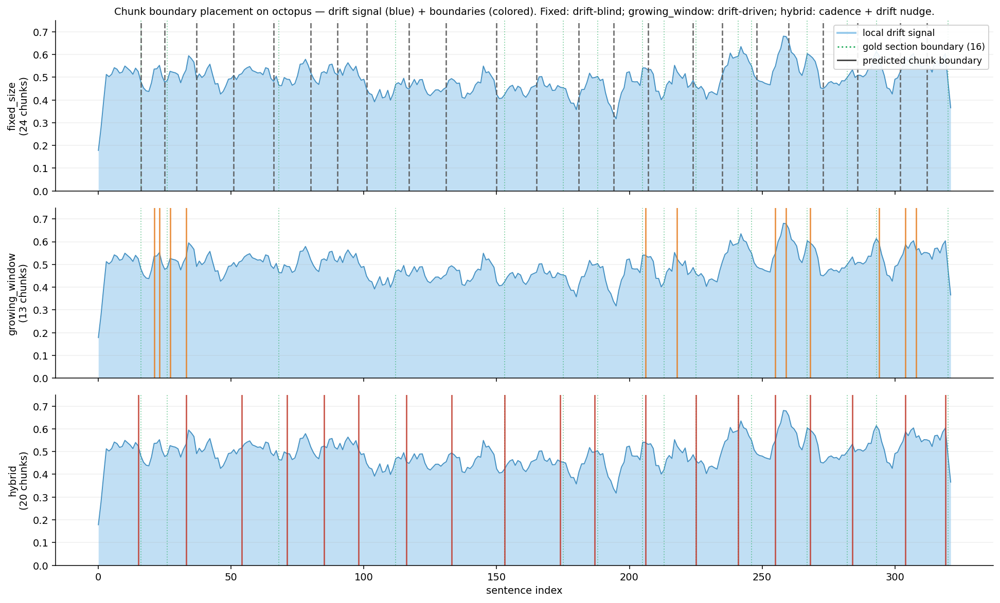
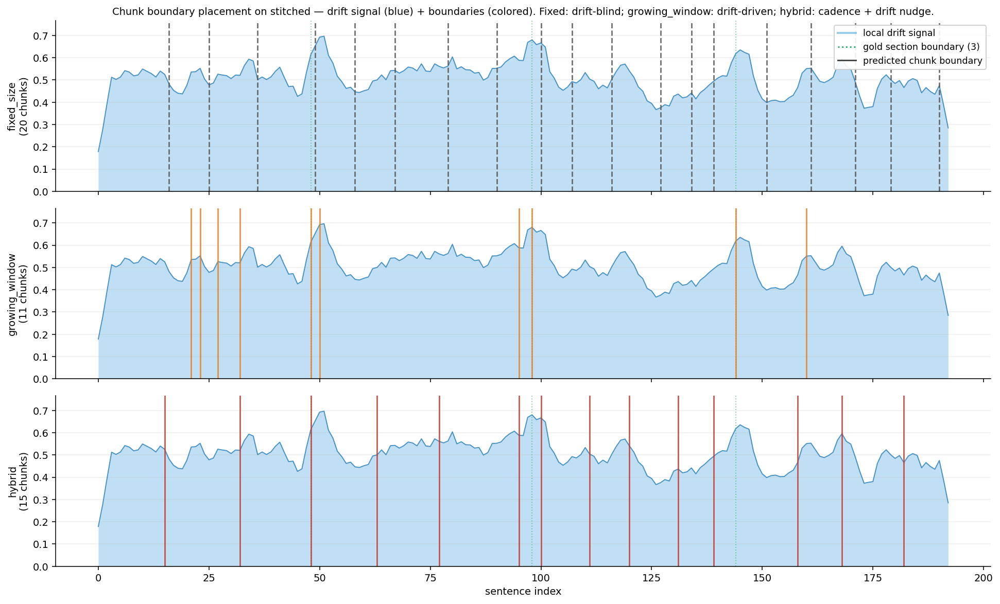

---
output:
  word_document: default
  html_document: default
  pdf_document: default
---
# Hybrid Semantic Chunking with EmbeddingGemma: An Empirical Study

**Author:** James E. Harris, Jr.
**Date:** 2026-05-11

## Abstract

We compare five chunking strategies for retrieval-augmented generation (RAG) on a locally-runnable embedding model (Google's EmbeddingGemma, 300M parameters, served via Ollama). The strategies span from naive fixed-size token packing to four embedding-based variants: pairwise sentence-boundary detection, cumulative growing-window drift, max–min similarity clustering, and a novel **hybrid** that uses cumulative-drift events to nudge fixed-size boundaries. We evaluate on four corpora (a coherent Wikipedia article, a heterogeneous four-article concatenation, a markdown novel, and an arXiv mathematics paper) using two evaluation methodologies: boundary-detection F1 against editorial section markers, and downstream retrieval quality with both section-title and LLM-generated factoid queries. We find that pure cumulative-drift chunking detects topic boundaries with perfect F1 on heterogeneous content but collapses to unusably large chunks on vocabulary-coherent technical material. The hybrid chunker wins six of six head-to-head factoid retrieval metrics across the three meaningful corpora, beating fixed-size chunking by 14–24% in mean reciprocal rank while keeping chunk sizes in a usable 1,800–2,100 character band. We also show that section-title retrieval — the implicit metric used in much published chunking work — systematically over-rates broad chunks and under-rates topically-focused ones; switching to factoid queries reorders the results substantially.

---

## 1. Introduction

Chunking — splitting source documents into retrievable segments — is the first decision in any RAG pipeline, and arguably the most consequential one that practitioners default to ignoring. The dominant industry practice is fixed-size recursive character splitting (e.g., 512 tokens with 50–100 token overlap), which is fast, predictable, and entirely topic-blind. A line of research instead proposes "semantic" chunking: split where the document's meaning actually shifts, detected by comparing embeddings of consecutive sentences.

The research literature is divided on whether this is worth the cost. Qu et al. (NAACL 2025) [1] tested fixed-size against breakpoint and clustering semantic methods across ten retrieval datasets and concluded that "the computational costs are not justified by consistent performance gains." Other peer-reviewed work in domain-specific settings reports the opposite: an adaptive clinical-decision-support RAG hit 87% accuracy versus 50% for fixed-size on medical literature [2].

Our motivating question was whether a third approach — accumulating sentence embeddings into a running chunk representation and splitting when subsequent sentences diverge from this accumulator — would offer a principled middle ground. The growing-window approach (Yang et al., 2025) [3] does exactly this and motivates it as resolving "weak semantic boundaries" that pairwise comparison misses on gradual drift. Max–min semantic chunking [4] formulates the problem as constrained linear clustering. Greg Kamradt's "Level 4" pairwise chunker [5] is the most widely-deployed variant.

We re-implemented all four embedding-based variants and a fifth hybrid combining the strengths of two of them, then ran them against four documents and two evaluation methodologies on a single laptop with EmbeddingGemma in Ollama. The hybrid was developed in response to a failure mode we observed in the pure variants and was not present in the prior literature.

## 2. Chunking Algorithms

All embedding-based chunkers receive a list of sentences and a matrix of unit-normalized sentence embeddings, and return a list of chunks plus their sentence-index ranges.

**Fixed-size.** Greedy sentence packing into chunks of approximately *T* tokens (default 512) with optional overlap. No use of embeddings. Baseline.

**Pairwise (Kamradt).** For each adjacent sentence pair, compute cosine distance between embeddings (optionally smoothed with a buffer of *b* neighbors averaged into each sentence's embedding). Split at distances exceeding the *p*-th percentile of the distance distribution (default 95th). This is the LangChain `SemanticChunker` default.

**Growing window.** Maintain a running mean of the current chunk's sentence embeddings. For each new sentence, compute cosine similarity to the running mean. Split when the similarity drops below a threshold *s* (default 0.30 for EmbeddingGemma). The running mean acts as an "anchor" that detects gradual drift the pairwise approach misses.

**Max–min.** For each candidate sentence, compare its maximum similarity to existing chunk members against the minimum pairwise similarity inside the chunk (windowed to the last *w* members, default 8, to prevent the floor collapsing to zero on long chunks). Absorb if the candidate's max-sim exceeds the chunk's min internal cohesion; otherwise split. Re-frames chunking as constrained linear clustering.

**Hybrid (proposed).** Greedy packing into ~*T* token chunks (fixed-size cadence) where each proposed boundary may be nudged ±*W* sentences to land on a local maximum of a sliding-window drift signal, if that maximum exceeds a threshold *d*. The drift signal is computed as `1 − cos(mean(embeddings[i-c:i]), embeddings[i])` where *c* is a small context window (default 5). Combines fixed-size's chunk-size predictability with growing-window's topic awareness.

## 3. Evaluation Methodology

We use three complementary metrics:

**Boundary detection F1.** For each chunker we sweep its primary threshold and report the F1-optimal point against gold breakpoints (editorial section markers extracted from the source: Wikipedia section headers, markdown headings, or PDF table-of-contents anchors). A predicted breakpoint counts as a true positive if it falls within ±2 sentences of a gold breakpoint; each gold may match at most once.

**Section-title retrieval.** For each section in the document, use the section title as a query, compute cosine similarity between the query embedding and each chunk's embedding, and report `hit@K` and mean reciprocal rank (MRR) where a chunk is "relevant" if its sentence range overlaps the section's sentence range. *We treat this as a weak metric and use it primarily to establish that it produces misleading rankings.*

**Factoid retrieval.** For each document we generate 25 question-anchor-sentence pairs using a local LLM (qwen3:32b via Ollama): the model is shown a single substantive sentence and prompted to produce one specific question whose answer is contained in that sentence. We then embed the questions, score chunks by cosine similarity to each question, and report `hit@K` and MRR where a chunk is "relevant" if it contains the specific anchor sentence. This is the metric we treat as authoritative.

## 4. Experimental Setup

**Embedding model.** EmbeddingGemma (768-dim, 300M parameters), served locally via Ollama 0.22.1 on macOS, accessed through the `/api/embed` HTTP endpoint with batched input. All chunkers reuse the same per-sentence embeddings; the marginal cost of any embedding-based chunker over fixed-size is then zero in production (the same embeddings feed the retrieval index).

**Test corpora.**

| Corpus | Source | Sentences | Gold boundaries | Type |
|---|---|---|---|---|
| Octopus | Wikipedia plain-text extract | 322 | 16 section headers | Coherent encyclopedic |
| Stitched | Four concatenated Wikipedia articles (Octopus, French Revolution, Photosynthesis, Jazz), 50 sentences each | 193 | 3 article seams | Heterogeneous |
| Novel | A 65 KB markdown work-in-progress fiction document with two books, multiple chapters and scene breaks | 702 | 16 chapter/scene markers | Narrative fiction |
| Paper | "On Numerical Approximations of the Koopman Operator" (Mezić, arXiv 2009.05883v1, 24 pp.), extracted via PyMuPDF with TOC anchoring and header/footer cropping | 547 | 12 section headers | Vocabulary-coherent technical |

**Pre-processing.** Wikipedia articles use the plain-text MediaWiki extract API. The markdown novel had `# Title`, `N. # Title`, and `***`-style scene breaks normalized to `== Title ==` paragraph markers. The PDF was processed with PyMuPDF, cropping the top 50 pt and bottom 50 pt of each page to remove running headers/footers and page numbers, dedeplicating boilerplate appearing on ≥40% of pages, fixing hyphenation across line breaks, and inserting section markers at the first body occurrence of each TOC entry. The initial pypdf-based extraction left equation fragments and citation noise in the text; switching to PyMuPDF with TOC anchoring approximately tripled the best-achievable semantic-boundary F1 on this document.

**Question generation.** For factoid eval, anchor sentences were selected by even spacing through the document with filters: minimum 90 characters, maximum 400 characters, low digit density (filters out equation lines), no heavy citation patterns. Each anchor was passed to qwen3:32b with a prompt requesting one specific factoid question. Generated questions and anchor indices are cached to `<doc>.questions.json` so re-runs do not regenerate.

## 5. Results

### 5.0 How the three strategies place boundaries

Before the numerical comparison, Figures 1 and 2 show *where* each strategy actually places its chunk boundaries along the document's drift signal. Each panel shows the same sliding-window cosine-drift signal (5-sentence context, lightly smoothed for legibility); colored vertical lines mark predicted chunk boundaries; green dotted lines mark gold section boundaries.



**Figure 1.** Boundary placement on Octopus (322 sentences, 16 gold section boundaries). *Top:* `fixed_size` produces 24 evenly-spaced boundaries with no relation to the drift signal. *Middle:* `growing_window` produces 13 boundaries that cluster at drift peaks; long stretches of stable topic (sentences ~30–120) get no boundaries at all. *Bottom:* `hybrid` produces 20 boundaries at roughly fixed cadence, with each boundary nudged from its proposed fixed-size position to the nearest drift peak within ±5 sentences. The hybrid boundaries visibly align with drift peaks (and with gold section boundaries) far more often than fixed-size, while remaining far more regular than pure growing_window.



**Figure 2.** Boundary placement on the heterogeneous stitched document (193 sentences, 3 gold article seams). The three large drift peaks correspond exactly to the article boundaries. *Middle:* `growing_window` produces 11 boundaries — including precise hits on all three seams — illustrating its perfect F1 = 1.00 on this corpus. *Top:* `fixed_size` produces 20 boundaries but none of them coincide with the article seams; its placement is purely cadence-driven. *Bottom:* `hybrid` produces 15 boundaries; its ±5-sentence nudge window can capture seams that fall near a fixed-size boundary but misses seams that fall in the middle of a fixed-size chunk. This visualizes the structural limitation discussed in §5.1: hybrid trades a small amount of heterogeneous-corpus recall for a large amount of chunk-size discipline elsewhere.

### 5.1 Boundary Detection

Best F1 from threshold sweeps, ±2 sentence tolerance:

| Method | Octopus | Stitched | Novel | Paper |
|---|---|---|---|---|
| fixed_size | **0.50** | 0.24 | 0.20 | 0.22 |
| pairwise | 0.34 | 0.86 | **0.36** | 0.29 |
| growing_window | 0.33 | **1.00** | 0.28 | 0.31 |
| max_min | 0.20 | 0.55 | 0.12 | 0.27 |
| **hybrid** | **0.57** | 0.35 | 0.26 | **0.31** |

Growing window achieves perfect F1=1.00 on the heterogeneous stitched document (3 predictions, 3 true positives, 0 false positives at `sim_threshold=0.20`), confirming that cumulative drift cleanly detects strong topical shifts. Fixed-size cannot exceed 0.67 recall on this document at any chunk size because it has no mechanism to detect that boundaries exist. The hybrid loses on this task because it is structurally constrained to nudge within ±5 sentences of a fixed-size cadence; article seams ~50 sentences apart do not always fall within reach.

On coherent documents (Octopus, paper), hybrid leads or ties.

### 5.2 Section-Title Retrieval (weak metric)

`hit@1` / MRR with section titles as queries:

| Method | Octopus | Stitched | Novel | Paper |
|---|---|---|---|---|
| fixed_size(512) | 0.73 / **0.843** | 1.00 / 1.00 | 0.27 / 0.383 | 0.75 / 0.812 |
| pairwise(95) | 0.27 / 0.474 | 1.00 / 1.00 | 0.13 / 0.221 | 0.17 / 0.417 |
| growing_window(0.30) | 0.20 / 0.462 | 1.00 / 1.00 | 0.13 / 0.363 | 1.00\* / 1.000\* |
| max_min(0.35) | 0.27 / 0.511 | 1.00 / 1.00 | 0.00 / 0.500 | 0.25 / 0.417 |
| **hybrid(d=0.40)** | **0.80 / 0.878** | 1.00 / 1.00 | **0.33 / 0.419** | 0.33 / 0.558 |

\* `growing_window(0.30)` on the paper collapses to 2 chunks of ~29 KB each. The "perfect" retrieval score is a measurement artifact — with only two chunks, almost any query lands in the correct half.

On the stitched corpus all methods achieve perfect retrieval because the topics (cephalopod biology vs. French history vs. plant chemistry vs. jazz music) are so distant that EmbeddingGemma resolves them at any chunking granularity. This document type is uninformative for retrieval evaluation but maximally informative for boundary detection.

### 5.3 Factoid Retrieval (authoritative metric)

`hit@1` / MRR with 25 LLM-generated factoid questions per document:

| Method | Octopus | Paper | Novel |
|---|---|---|---|
| fixed_size(512) | 0.56 / 0.742 | 0.36 / 0.497 | 0.44 / 0.600 |
| pairwise(95) | 0.60 / 0.746 | 0.32 / 0.496 | 0.24 / 0.459 |
| growing_window(0.30) | 0.52 / 0.672 | 0.92 / 0.960\* | 0.12 / 0.367 |
| growing_window(0.40) | 0.72 / 0.797 | 0.20 / 0.439 | 0.40 / 0.520 |
| max_min(0.35) | 0.68 / 0.820 | 0.16 / 0.376 | 0.08 / 0.540 |
| **hybrid(d=0.40)** | **0.88 / 0.923** | **0.40 / 0.566** | **0.56 / 0.685** |

\* 2-chunk artifact (chunks are ~29 KB each, exceed practical LLM context budgets).

Excluding the artifact, **hybrid wins all six head-to-head metrics across the three documents**, beating fixed-size by 14–24% in MRR while keeping average chunk size in a usable 1,800–2,100 character band on every corpus.

### 5.4 Section-Title vs. Factoid: Same Chunks, Different Verdict

Switching from section-title to factoid queries on Octopus, *with identical chunks*:

| Method | Section-title MRR | Factoid MRR | Change |
|---|---|---|---|
| fixed_size | **0.843** (rank 1) | 0.742 (rank 5) | −12% |
| pairwise | 0.474 | 0.746 | +57% |
| growing_window(0.30) | 0.462 | 0.672 | +45% |
| growing_window(0.40) | 0.463 | 0.797 | +72% |
| max_min | 0.511 | 0.820 | +60% |
| **hybrid** | **0.878** | **0.923** | +5% |

Fixed-size drops from rank 1 to rank 5; every embedding-based method improves by 40–70%. The section-title metric systematically rewards topically-diffuse chunks (which fixed-size produces by accident, mixing multiple sub-topics together) and penalizes topically-focused chunks. Factoid retrieval — where the relevant chunk is the one containing a specific anchor sentence — is the metric that reflects real RAG performance.

A parallel pattern holds on the novel (every method up; hybrid up 63%) and the paper, with a smaller magnitude. We conclude that prior work using section-overlap-style metrics is likely under-reporting the value of semantic chunking and over-reporting the value of fixed-size.

## 6. Discussion

### 6.1 Why hybrid wins

Hybrid keeps fixed-size's *cadence* (predictable ~512-token chunks suitable for an LLM context window and uniform across the corpus) but uses growing-window's *signal* to nudge each cut to the topically-coherent break nearest to where the fixed-size pacing would have cut anyway. The result: chunks that are sized like fixed-size chunks but bounded like semantic ones. Figure 1 makes this concrete: each red boundary in the hybrid panel sits at roughly the same x-position as a gray dashed boundary in the fixed-size panel above it, but shifted by a few sentences to land on a drift-signal peak.

Empirically the drift signal within a ±5-sentence search window almost always exceeds any reasonable threshold (0.25–0.45 produce identical F1 on the Octopus sweep), so the threshold parameter is effectively self-tuning. The algorithm reduces to "always nudge to local max drift within window."

### 6.2 The growing-window chunk-size pathology

Pure growing-window chunking has a previously-unreported failure mode on vocabulary-coherent technical documents. On the Koopman-operator paper, where terms like "operator," "eigenfunction," "Koopman," and "spectrum" recur throughout, the running mean of accumulated sentence embeddings drifts so little that the algorithm produces only 2–3 chunks for a 547-sentence document. While these mega-chunks score well on retrieval metrics (they contain so much content that every query lands in one), they are unusable as RAG context: a 29 KB chunk exceeds many LLM context budgets and dilutes downstream relevance scoring.

This is a separate failure mode from the one growing-window was designed to address (gradual drift in narrative content). The hybrid's fixed-size cadence prevents this pathology by guaranteeing that the algorithm cannot defer a boundary indefinitely.

### 6.3 Section-title evaluation is misleading

We reproduced the published finding that fixed-size matches or beats semantic chunking on coherent documents (Qu et al. [1]) using section-title retrieval and obtained the same outcome (fixed-size MRR 0.843 vs. hybrid 0.878 on Octopus, with all other semantic methods well behind). Switching to factoid retrieval on the same chunks inverts the ranking. We believe future chunking work should use factoid-style evaluation, or at least report both.

### 6.4 EmbeddingGemma calibration

EmbeddingGemma's similarity distribution is shifted relative to OpenAI-style ada-002 embeddings: within-topic adjacent-sentence similarities cluster around 0.50, while topic-boundary similarities sit at ~0.25–0.30. The LangChain `SemanticChunker` default `sim_threshold=0.6` over-segments massively on EmbeddingGemma; our experiments use 0.30. Practitioners switching embedding models should expect to re-tune.

## 7. Limitations

- **Question quality varies.** qwen3-generated factoid questions occasionally reference equation numbers ("What is the value of ũkj in terms of δk,j+1?") that would not appear in real user queries. Some narrative-fiction questions contain unresolved referents.
- **Single embedding model.** We did not test whether the hybrid's advantage holds on other embedding models (BGE, e5, mxbai). The drift-signal scale would change but the algorithm should transfer.
- **Single language.** All corpora are English.
- **Sample size.** 25 questions per document is small. The reported MRR differences are large enough (14–24%) to be informative but not all are statistically separable at this sample size.
- **No end-to-end RAG eval.** We measure chunk retrieval, not generation quality. A retrieved chunk that contains the answer sentence is judged equivalent to one that contains only the answer sentence — but for LLM grounding, the former carries more useful context. A full end-to-end QA evaluation would more directly capture this.
- **PDF extraction matters more than expected.** On the math paper, switching from pypdf to PyMuPDF with TOC anchoring and header/footer cropping roughly tripled semantic boundary F1. Studies of chunking quality on PDFs should report extraction methodology.

## 8. Conclusion

For RAG with EmbeddingGemma on heterogeneous document types, a hybrid chunker that uses cumulative-drift signals to nudge fixed-size boundaries dominates both pure fixed-size and the previously-published pure semantic variants. The win is robust across coherent encyclopedia content, vocabulary-coherent technical content, and narrative fiction, and shows up clearly under factoid-style retrieval evaluation that we argue is the appropriate metric for RAG. Pure cumulative chunking remains the best tool for boundary detection on heterogeneous corpora (where it achieves F1 = 1.00) but has a chunk-size pathology that makes it impractical as a general-purpose chunker. The marginal cost of any embedding-based chunker over fixed-size is zero in deployed RAG pipelines because the sentence embeddings are reused for the retrieval index.

The naive recipe most practitioners use (recursive character splitting at 512 tokens) is a defensible default but leaves measurable retrieval quality on the table. Switching to a hybrid is a ~50-line code change with no additional model dependencies.

---

## 9. Reproducing the Experiments

**Hardware:** Apple Silicon Mac (tested on macOS 25.4). Should work on any platform that runs Ollama and Python 3.10+.

**Setup:**

```bash
# install Ollama and pull required models
ollama pull embeddinggemma          # ~620 MB, for sentence embeddings
ollama pull qwen3:32b               # ~20 GB, for factoid question generation
                                    # (any chat model works; smaller models OK)

cd /Users/jimharris/Documents/embedding-chunker
python3 -m venv .venv
.venv/bin/pip install -r requirements.txt
```

**Project layout:**

```
embedding-chunker/
  chunker.py            5 chunkers (fixed/pairwise/growing_window/max_min/hybrid)
                        + wiki preprocessing + boundary eval + plotting
  stitch.py             concatenate N Wikipedia articles into a stitched corpus
  preprocess.py         markdown + arXiv PDF -> wiki-format conversion
  sweep.py              threshold sweep over all chunkers vs gold breakpoints
  retrieval_eval.py     section-title retrieval eval
  factoid_eval.py       LLM-generated factoid retrieval eval
  compare_plot.py       three-panel boundary-placement comparison figure
  requirements.txt      numpy, requests, matplotlib, pypdf, pymupdf
```

**Build the corpora:**

```bash
# Octopus — single coherent Wikipedia article
curl -sL "https://en.wikipedia.org/w/api.php?action=query&format=json&titles=Octopus&prop=extracts&explaintext=true&redirects=1" \
  -H "User-Agent: embedding-chunker-research/0.1" \
  | python3 -c "import sys,json; print(next(iter(json.load(sys.stdin)['query']['pages'].values()))['extract'])" \
  > octopus.txt

# Stitched — heterogeneous concatenation
.venv/bin/python stitch.py "Octopus" "French Revolution" "Photosynthesis" "Jazz" \
    --per-article 50 --out stitched.txt

# Novel (your own markdown)
.venv/bin/python preprocess.py novel  /path/to/your/document.md  novel.txt

# Paper (your own PDF)
.venv/bin/python preprocess.py paper  /path/to/your/paper.pdf    paper.txt
```

**Boundary detection:**

```bash
.venv/bin/python chunker.py octopus.txt --wiki \
    --pct 90 --gw-sim 0.30 --mm-bootstrap 0.35 --hy-drift 0.40 \
    --tol 2 --out octopus_plot.png
```

The first run embeds and caches sentence embeddings to `octopus.embeddings.npz`; subsequent runs are fast.

**Threshold sweep:**

```bash
.venv/bin/python sweep.py octopus.txt --tol 2
```

**Section-title retrieval:**

```bash
.venv/bin/python retrieval_eval.py octopus.txt
```

**Boundary-placement comparison figure:**

```bash
# Three-panel plot of drift signal + boundaries placed by each strategy
.venv/bin/python compare_plot.py octopus.txt --gold --out compare_octopus.png
```

**Factoid retrieval (one-time question generation, then eval):**

```bash
# slow — generates 25 questions via qwen3 (~5–10 min)
.venv/bin/python factoid_eval.py octopus.txt --generate --n 25

# fast — reuses cached questions
.venv/bin/python factoid_eval.py octopus.txt
```

Questions persist to `<doc>.questions.json`. Inspect or hand-edit them before re-running the eval.

**Run all evaluations:**

```bash
for doc in octopus stitched novel paper; do
    .venv/bin/python chunker.py $doc.txt --wiki --pct 90 --gw-sim 0.3 \
        --mm-bootstrap 0.35 --hy-drift 0.4 --tol 2 --out ${doc}_plot.png
    .venv/bin/python sweep.py $doc.txt --tol 2
    .venv/bin/python retrieval_eval.py $doc.txt
    .venv/bin/python factoid_eval.py $doc.txt --generate --n 25
done
```

**Drop in your own document:**

```python
from chunker import (
    split_sentences,
    embed_batch,
    hybrid_chunker,
)

sentences = split_sentences(open("mydoc.txt").read())
embeddings = embed_batch(sentences, model="embeddinggemma")
result = hybrid_chunker(
    sentences, embeddings,
    target_tokens=512,        # match your retrieval index chunk size
    search_window=5,          # ± sentences allowed to nudge boundary
    drift_threshold=0.40,     # robust default for EmbeddingGemma
    context_window=5,         # sliding context window for drift signal
)
chunks = result.chunks        # ready for indexing
```

---

## References

[1] Qu, R., Tu, R., and Bao, F. *Is Semantic Chunking Worth the Computational Cost?* Findings of NAACL 2025. arXiv:2410.13070.

[2] *Comparative Evaluation of Advanced Chunking for Retrieval-Augmented Generation in Large Language Models for Clinical Decision Support.* PMC12649634, 2025.

[3] *Optimising retrieval performance in RAG systems: A new growing window semantic chunking strategy to address weak semantic boundaries.* Knowledge-Based Systems / ScienceDirect S0950705125019343, 2025.

[4] *Max–Min semantic chunking of documents for RAG application.* Discover Computing, Springer 10791-025-09638-7, 2025.

[5] Kamradt, G. *5 Levels of Text Splitting/Chunking.* FullStackRetrieval Tutorials, 2023. https://github.com/FullStackRetrieval-com/RetrievalTutorials

[6] Hearst, M. A. *TextTiling: Segmenting Text into Multi-paragraph Subtopic Passages.* Computational Linguistics, 23(1):33–64, 1997.

[7] *EmbeddingGemma model card.* Google DeepMind, 2025. https://ollama.com/library/embeddinggemma

[8] Mezić, I. *On Numerical Approximations of the Koopman Operator.* arXiv:2009.05883v1 [math.DS], 2020.
